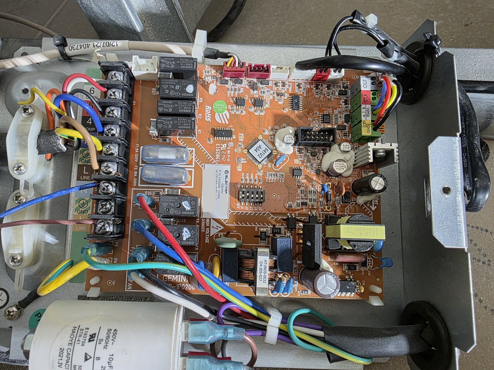
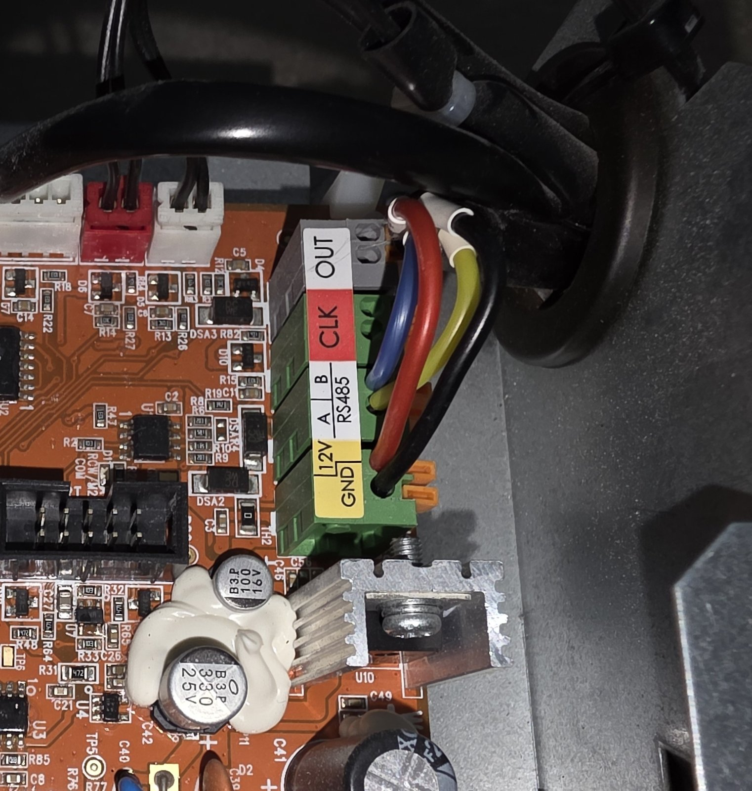
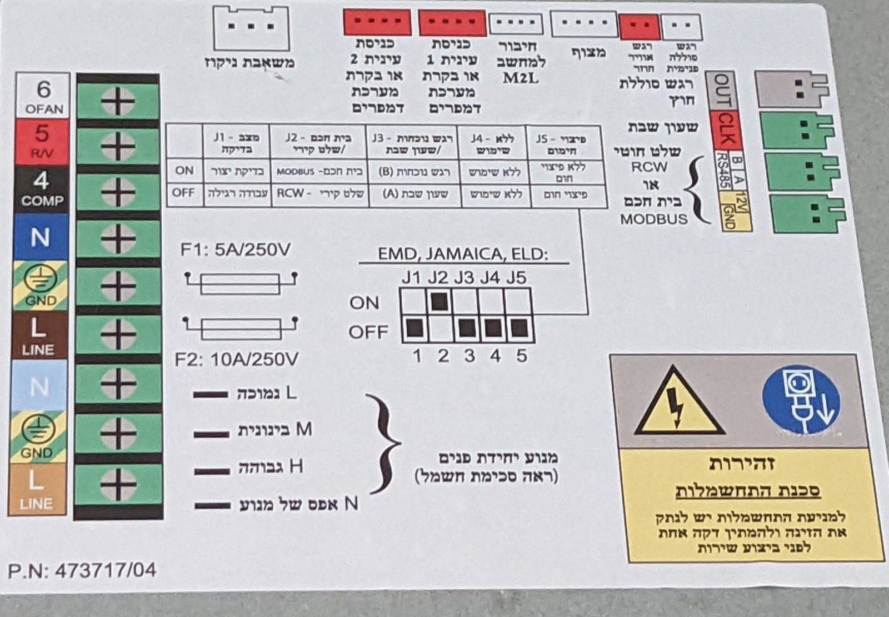
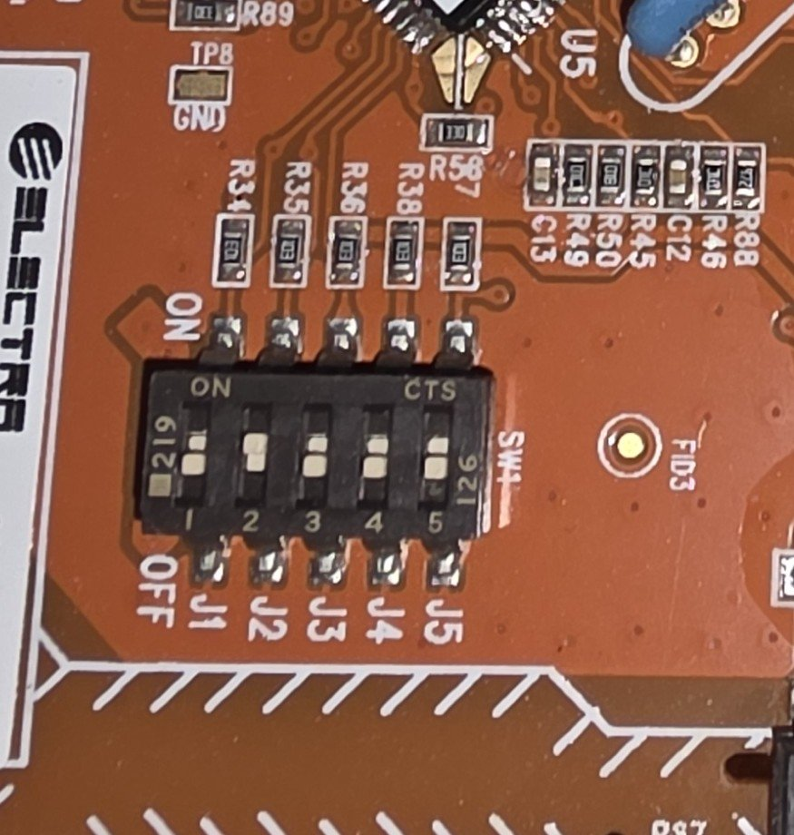

# Wiring the gateway to the GEMINI board

> **Unofficial, independent work, not affiliated with or endorsed by Electra, Airwell or Elfin. Provided "as is",
> without any warranty; use it at your own risk.** Opening the indoor unit exposes mains voltage and may affect the
> manufacturer's warranty. See the [Disclaimer](../README.md#disclaimer) and the [licence](../LICENSE)
> (AGPL-3.0-or-later).

**Switch the air conditioner off at the mains before opening it.** The label on the board's enclosure also asks to wait
one minute after disconnecting before any service.

## The controller board

The GEMINI board in the indoor unit's electrical box. The Modbus connection is on the terminal block at the top right
(labelled `OUT`, `CLK`, `B` / `A` `RS485`, `12V` / `GND`); the DIP switches are in the middle, next to the white sticker
(its serial number is hidden in this photo).

## Connections

The terminal block is labelled, from the top: `OUT`, `CLK`, then `B`, `A` (`RS485`), `12V` and `GND`. The gateway
connects to the last four:

| Gateway (EW11) | Controller board |
|---|---|
| GND | GND |
| Power (+) | 12V |
| A | A |
| B | B |

* The board's `12V` terminal powers the gateway; check that yours accepts 12 V DC.
* `OUT` and `CLK` are not used. On the enclosure label the RS-485 block is marked for a wired wall controller (RCW) or a
  smart home (Modbus), and `OUT` / `CLK` for a Shabbat clock.

## DIP switches

**J2 must be set to MODBUS (ON).** The label on the board's enclosure (in Hebrew) explains the five switches:

| Switch | Function | ON | OFF |
|---|---|---|---|
| J1 | Test mode | factory test | normal operation |
| **J2** | **Smart home / wall controller** | **smart home: MODBUS** | wired wall controller (RCW) |
| J3 | Presence sensor / Shabbat clock | presence sensor (B) | Shabbat clock (A) |
| J4 | (not used) | | |
| J5 | Heating compensation | no heating compensation | heating compensation |

The label's diagram (for its listed models) shows J2 ON and J1, J3, J4 and J5 OFF.

The switches on the board (`SW1`), J1 to J5 from left to right, with ON at the top.

## Gateway settings

The gateway must convert Modbus TCP to Modbus RTU: UART 9600 baud, 8N1, no flow control, protocol Modbus, a TCP server
on port 8899 by default. The EW11 configuration the integration was developed with is in
[`EW11_reference_config.xml`](EW11_reference_config.xml) (a reference only).
